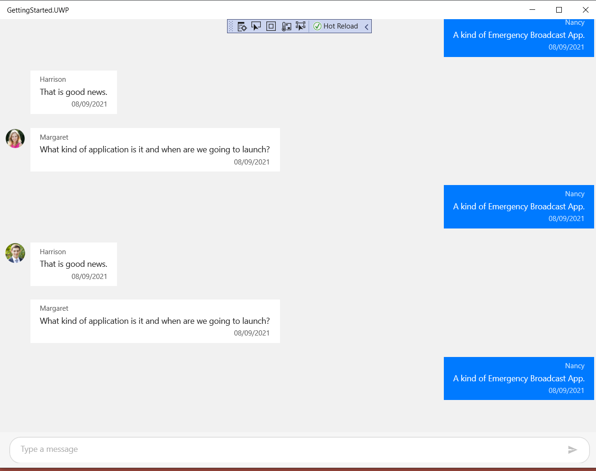

# How to show Scrollbar in SFChat to scroll messages up or down?
## About the sample

This example demonstrates how to enable scrollbar in SfChat to scroll messages up and down.

By default, the [SfChat](https://help.syncfusion.com/cr/xamarin/Syncfusion.XForms.Chat.html) does not have support to show scrollbar. However, we can achieve this by enabling [IsScrollBarVisible](https://help.syncfusion.com/cr/xamarin/Syncfusion.ListView.XForms.SfListView.html#Syncfusion_ListView_XForms_SfListView_IsScrollBarVisible) property for [SfListView](https://help.syncfusion.com/cr/xamarin/Syncfusion.ListView.XForms.SfListView.html) control. 

```XAML
<?xml version="1.0" encoding="utf-8" ?>
<ContentPage xmlns="http://xamarin.com/schemas/2014/forms"
             xmlns:x="http://schemas.microsoft.com/winfx/2009/xaml"
             xmlns:d="http://xamarin.com/schemas/2014/forms/design"
             xmlns:mc="http://schemas.openxmlformats.org/markup-compatibility/2006"
             xmlns:local="clr-namespace:GettingStarted"
             xmlns:sfChat="clr-namespace:Syncfusion.XForms.Chat;assembly=Syncfusion.SfChat.XForms"
             mc:Ignorable="d"
             x:Class="GettingStarted.ChatPage">

    <ContentPage.BindingContext>
        <local:ViewModel x:Name="viewModel" />
    </ContentPage.BindingContext>
    
    <ContentPage.Content>
        <StackLayout Orientation="Vertical">
            <sfChat:SfChat x:Name="sfChat" 
                           Messages="{Binding Messages}"
                           CurrentUser="{Binding CurrentUser}">
            </sfChat:SfChat>
        </StackLayout>
    </ContentPage.Content>
</ContentPage>

```
 

```C#
    public partial class ChatPage : ContentPage
    {
        public ChatPage()
        {
            InitializeComponent();
            (this.sfChat.GetType().GetRuntimeProperties().FirstOrDefault(x => x.Name.Equals("ChatListView")).GetValue(this.sfChat) as SfListView).IsScrollBarVisible = true;

        }
    }
```



## <a name="requirements-to-run-the-demo"></a>Requirements to run the demo ##

* [Visual Studio 2017](https://visualstudio.microsoft.com/downloads/) or [Visual Studio for Mac](https://visualstudio.microsoft.com/vs/mac/).
* Xamarin add-ons for Visual Studio (available via the Visual Studio installer).

## <a name="troubleshooting"></a>Troubleshooting ##
### Path too long exception
If you are facing path too long exception when building this example project, close Visual Studio and rename the repository to short and build the project.
